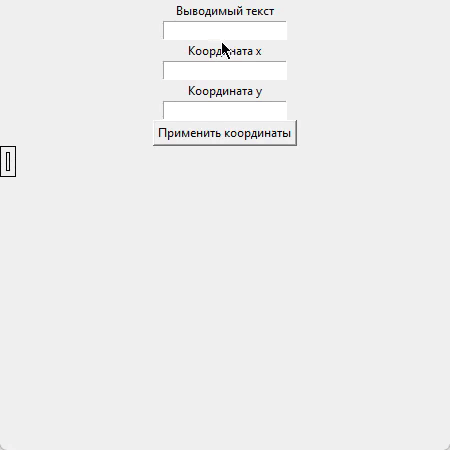

# tkinter-resize-inputed-text-app


## Preview

Python application with tkinter, which was able to resize entered text and set his start position.



## How to install

```
git clone https://github.com/GrimAveira/tkinter-resize-inputed-text-app.git

install python

pip install tk

pip install pytest
# pytest for tests

```

## Task 6

Требуется составить программу, которая выводила бы на экран, начиная с заданной позиции, заданную строку текста, заключив ее в двойную рамку. При каждом нажатии клавиш ‘>‘ размер символов должен увеличиваться в 2 раза, а при нажатии клавиши ‘<‘ - уменьшаться в 2 раза. выход по нажатию клавиши Esc
